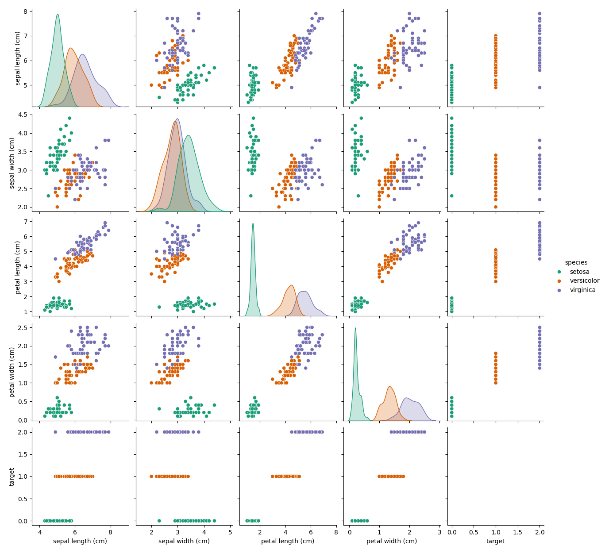

# Iris Flower Classification 🌸

A simple and elegant **Machine Learning project** that classifies Iris flowers into three species using **Logistic Regression**. This project covers the **complete ML workflow** and even includes an optional **Streamlit web UI** for interactive predictions.

[](https://www.python.org/downloads/)
[](https://opensource.org/licenses/MIT)



---

## 📌 Features

- 🌼 **Exploratory Data Analysis (EDA)** using Seaborn  
- 🔍 **Logistic Regression** for multi-class classification  
- 💾 **Model Persistence** using Joblib  
- 🧪 **100% Accuracy on Test Data**  
- 🖥️ Optional **Streamlit App for UI**  
- 📊 Beautiful **pairplot visualization** included

---

## 🛠 Tech Stack

- **Language**: Python  
- **Libraries**: Pandas, NumPy, Scikit-learn, Matplotlib, Seaborn, Joblib  
- **Optional UI**: Streamlit  
- **Tools**: Git, GitHub  

---

## 🚀 Installation

1. **Clone the repository**:

   ```bash
   git clone https://github.com/YOUR_USERNAME/iris-classification.git
   cd iris-classification
2. **Install required Python libraries:**:

   ```bash
   pip install pandas scikit-learn matplotlib seaborn joblib
4. **Train and Evaluate the Model**:

   ```bash
   python iris_classification.py
   
5. **Launch the Streamlit App (optional)**:

   ```bash
   pip install streamlit
6. **(Optional) Install Streamlit for web UI:**:

   ```bash
   streamlit run iris_app.py
   
## Folder Structure
```
📂 iris-classification
├── iris_classification.py     # Main script (training & evaluation)
├── iris_app.py                # Streamlit app (optional)
├── iris_classifier.joblib     # Saved trained model
├── iris_pairplot.png          # Visualization of features
├── README.md                  # Project documentation
└── .gitignore                 # Git ignored files
```

**Model Performance**
1. **Accuracy: 100% and Classification Report:**
   ```
                 precision    recall  f1-score   support

           0       1.00      1.00      1.00        10
           1       1.00      1.00      1.00        10
           2       1.00      1.00      1.00        10

    accuracy                           1.00        30
   macro avg       1.00      1.00      1.00        30
weighted avg       1.00      1.00      1.00        30
```

**🧪 Key Learnings**
✅ Built a complete ML pipeline from scratch

📊 Used visualization to identify petal width/length as key features

🧠 Learned model serialization with Joblib

🖥️ Deployed model with a Streamlit UI (optional)

